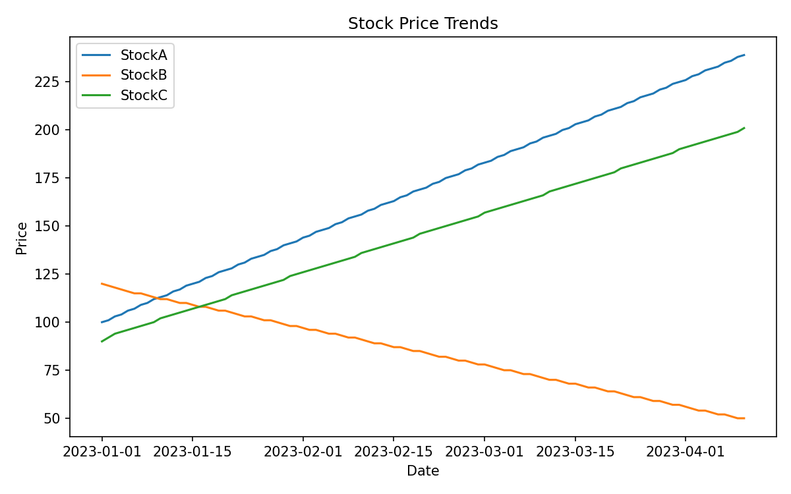

# Stock Price Trends

[](https://www.python.org/)
[](https://github.com/manikantmani2/Behavioural-Portfolio-Optimizer)
[](https://github.com/manikantmani2/Behavioural-Portfolio-Optimizer/commits/main)
[](https://choosealicense.com/no-permission/)

A lightweight Python project for stock trend analysis, portfolio risk estimation, pattern detection, and simple recommendation generation.

## Snapshot



## Why This Project

- Demonstrates end-to-end data-to-insight flow on market time-series data
- Computes return and volatility metrics using NumPy and Pandas
- Produces visual output suitable for reporting or demos
- Keeps architecture modular for easy extension

## Key Features

- CSV-based market data ingestion
- Automatic return-series preparation with sparse-data fallback
- Equal-weight portfolio baseline optimization
- Volatility-aware recommendation output
- Auto-generated trend visualization image

## Tech Stack

- Python
- Pandas
- NumPy
- Scikit-learn
- Matplotlib

## Project Structure

```text
.
|-- app.py
|-- requirements.txt
|-- README.md
|-- data/
|   `-- sample_market_data.csv
|-- docs/
|   `-- assets/
|       `-- stock-price-trends.png
|-- output/
|   `-- stock_price_trends.png
`-- src/
    |-- bias_detection.py
    |-- data_loader.py
    |-- portfolio_optimizer.py
    |-- recommendation_system.py
    `-- visualization.py
```

## Quick Start

1. Create and activate a virtual environment.

```powershell
python -m venv .venv
.\.venv\Scripts\Activate.ps1
```

2. Install dependencies.

```powershell
pip install -r requirements.txt
```

3. Run the project.

```powershell
python app.py
```

## Input Format

Expected CSV structure:

```csv
Date,StockA,StockB,StockC
1/1/2023,100,120,90
1/2/2023,101,119,92
...
```

## Runtime Output

The script prints:

- Portfolio allocation weights
- Expected return
- Portfolio volatility
- Pattern detection result
- Investment recommendation

The chart is saved at:

- output/stock_price_trends.png

## Roadmap

- Add advanced optimization methods
- Add unit tests and CI checks
- Add configurable risk appetite profiles
- Add support for more stocks and richer datasets

## License

This repository is currently unlicensed.
